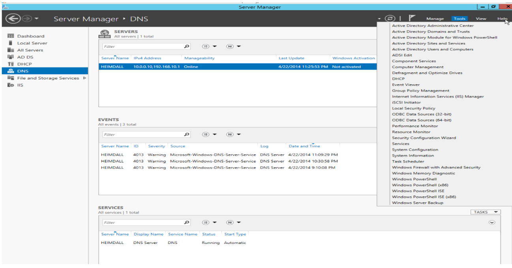
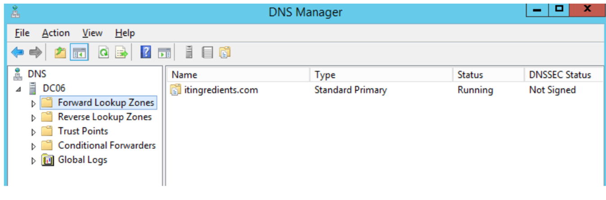
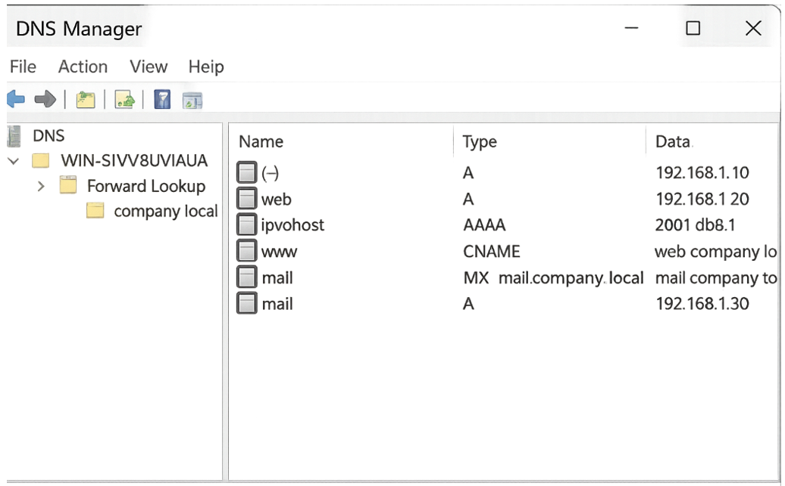
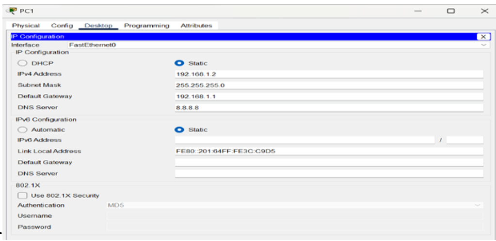
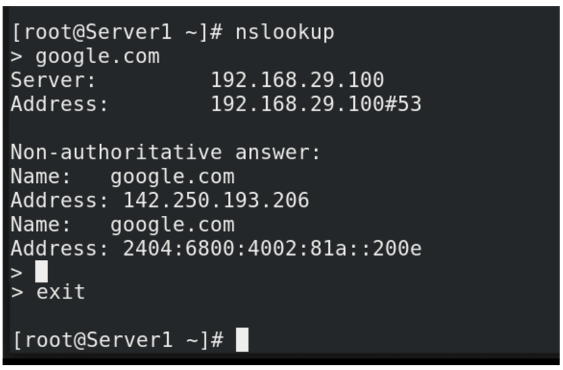
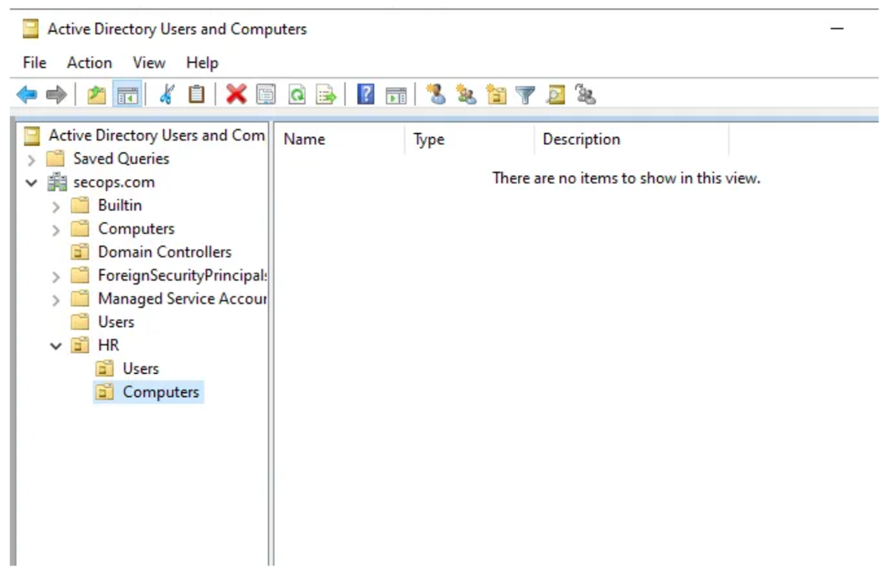
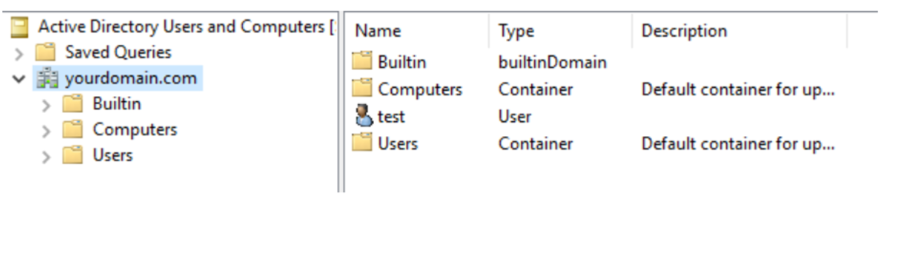

# Active Directory & DNS Administration Lab

## Overview

This lab documents hands-on Active Directory and DNS administration tasks performed during infrastructure training in a VMware Workstation lab environment.

The activities focused on Windows Server DNS configuration, DNS record management, client-side name resolution, and Active Directory organizational structure.

## Lab Environment

* VMware Workstation
* Windows Server
* Windows Workstation / Client
* DNS Server Role
* Active Directory Users and Computers
* Command Prompt

## Skills Practiced

* DNS Server installation and configuration
* Forward Lookup Zone configuration
* Reverse Lookup Zone configuration
* DNS record management
* DNS client configuration
* Name resolution testing
* `ipconfig` and `nslookup`
* Active Directory OU design
* User and computer account organization

## Assignment 1 — Windows Server Administration Basics

### Task 1 — Install and Configure DNS Server Role

The DNS Server role was installed on Windows Server using Server Manager.

### Steps Performed

1. Logged in to Windows Server with administrator credentials.
2. Opened Server Manager.
3. Selected **Add Roles and Features**.
4. Selected **Role-based or feature-based installation**.
5. Selected the **DNS Server** role.
6. Completed the installation process.
7. Opened DNS Manager to verify the DNS Server role.

## Task 2 — Configure Forward and Reverse Lookup Zones

A Forward Lookup Zone and Reverse Lookup Zone were configured for internal name resolution.

### Forward Lookup Zone

* Zone Name: `company.local`
* Zone Type: Primary Zone
* Dynamic Updates: Enabled

### Reverse Lookup Zone

* Network ID: `192.168.1`
* Type: IPv4 Reverse Lookup Zone

## Task 3 — DNS Record Management

The following DNS record types were practiced:

* **A Record** — Maps a hostname to an IPv4 address
* **AAAA Record** — Maps a hostname to an IPv6 address
* **CNAME Record** — Creates an alias for another hostname
* **MX Record** — Specifies the mail server for a domain

### Example Records

* `web.company.local` → `192.168.1.20`
* `mail.company.local` → MX Priority 10

## Assignment 2 — Name Resolution Process

### Task 1 — Configure DNS Client Settings

DNS client settings were configured on a Windows workstation to use the internal DNS server.

### Steps Performed

1. Opened Network and Sharing Center.
2. Selected Change Adapter Settings.
3. Opened IPv4 Properties.
4. Entered the DNS Server IP address manually.

## Task 2 — Verify Name Resolution

The following commands were used:

```cmd
ipconfig /all
nslookup company.local
```

The `nslookup` command was used to verify that the domain name resolved successfully to the configured IP address.

## Task 3 — Compare DNS Resolution Across Windows Versions

The assignment included a comparison of DNS resolution behavior across Windows versions.

* Windows 7 — DNS and HOSTS file
* Windows 10/11 — DNS, cache, and DoH
* Windows Server — DNS prioritized

## Assignment 3 — Active Directory Structure

### Task 1 — Design Logical AD Structure

A logical Active Directory structure was designed for a hypothetical medium-sized organization.

### Domain

```text
company.local
```

### Organizational Units

* HR
* IT
* Finance
* Computers
* Users

## Task 2 & 3 — Create OUs and User/Computer Hierarchy

Organizational Units were created and users and computers were placed into the appropriate OUs.

This structure supports easier administration and Group Policy management.

## Key Learnings

* Installing and verifying the DNS Server role
* Understanding forward and reverse DNS resolution
* Creating and managing common DNS record types
* Configuring DNS client settings
* Testing name resolution using `nslookup`
* Understanding differences in DNS resolution behavior across Windows versions
* Designing Active Directory OU structures
* Organizing users and computers in Active Directory

## Screenshots

### DNS Server Installation


### Forward and Reverse Lookup Zones


### DNS Records


### DNS Client Configuration


### NSLookup Verification


### Active Directory OU Structure


### Active Directory OU Hierarchy

