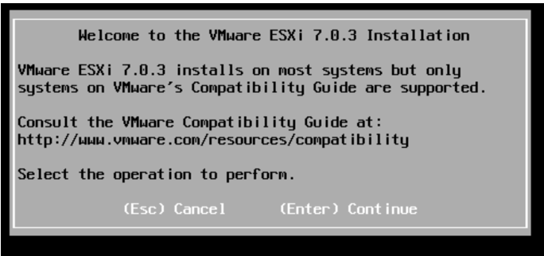
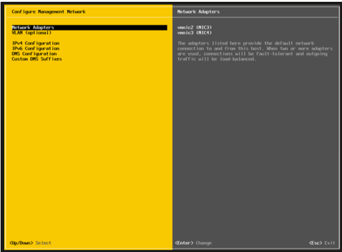
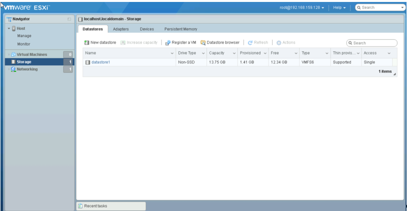
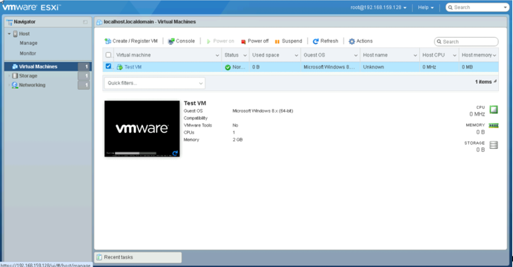
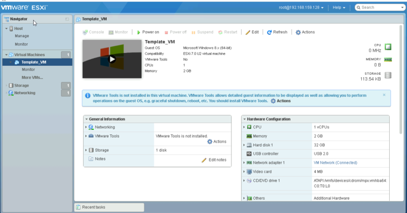
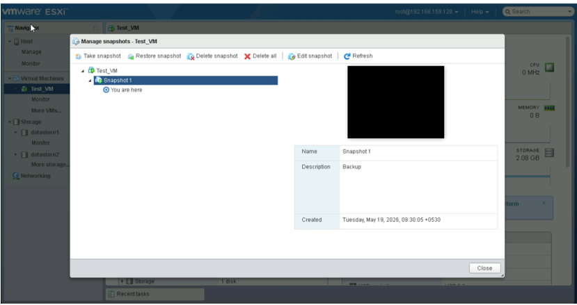

# VMware & Hyper-V Lab

## Overview

This lab documents hands-on virtualization activities performed during infrastructure training. The exercises focused on VMware ESXi installation, hypervisor configuration, virtual machine management, storage configuration, and advanced VM administration concepts.

## Lab Environment

- VMware ESXi
- VMware Host Client
- Virtual Machines
- Datastores
- Virtual Networking
- Hypervisor Environment

## Skills Practiced

- Hypervisor Installation
- ESXi Administration
- Network Configuration
- User Management
- Datastore Configuration
- Virtual Machine Management
- VM Templates
- VM Deployment
- VM Backup and Recovery
- Virtualization Concepts

  ## Technologies Covered

- VMware ESXi
- VMware Host Client
- Virtual Machines (VMs)
- Datastores
- VM Templates
- VM Snapshots
- Virtual Networking
- User and Role Management
- VM Deployment
- VM Backup Concepts
- vMotion (Conceptual)
- Hypervisor Administration

---

## Assignment 1 – Hypervisor Installation

### Tasks Performed

#### VMware ESXi Installation

- Installed VMware ESXi hypervisor
- Configured installation settings
- Completed initial setup

#### Network Configuration

- Configured management network
- Assigned static IP address
- Configured DNS and hostname
- Restarted management services

#### Remote Management

- Accessed ESXi Host Client through web interface
- Verified remote administration functionality

#### User Management

- Created user accounts
- Assigned roles and permissions
- Practiced access control

#### Storage Configuration

- Created and configured datastores
- Verified datastore availability
- Practiced storage management

#### Remote VM Management

- Created virtual machines
- Powered virtual machines ON and OFF
- Accessed VM console remotely

---

## Assignment 2 – Advanced VM Management

### Tasks Performed

#### VM Templates

- Created virtual machine templates
- Used templates for rapid deployment

#### Automated VM Deployment

- Deployed virtual machines using templates
- Practiced provisioning workflows

#### Startup and Shutdown Configuration

- Configured VM startup order
- Configured VM shutdown sequence

#### VM Migration

- Studied VMware vMotion concepts
- Practiced migration workflows where supported

#### VM Backup Strategies

- Created VM snapshots
- Explored backup concepts for virtual machines

#### Storage Types

- Worked with local datastore concepts
- Studied shared datastore architecture

---

## Tools & Technologies

```text
VMware ESXi
VMware Host Client
Virtual Machines
Datastore
Snapshots
vMotion
Templates
Virtual Networking
Hypervisor
```

## Key Learnings

- Hypervisor installation and configuration
- VMware ESXi administration
- Virtual machine lifecycle management
- User and role administration
- Datastore configuration
- VM templates and deployment
- Snapshot and backup concepts
- Virtualization and cloud infrastructure fundamentals

## Screenshots

### VMware ESXi Installation


**Activities Demonstrated**

- VMware ESXi installation
- Hypervisor deployment
- Initial host setup and configuration

---

### Network Configuration


**Activities Demonstrated**

- Management network configuration
- Static IP assignment
- DNS and hostname configuration
- Remote management preparation

---

### Datastore Configuration


**Activities Demonstrated**

- Datastore creation
- Storage repository configuration
- Storage resource management

---

### Virtual Machine Management


**Activities Demonstrated**

- Virtual machine creation
- Power ON/OFF operations
- Remote console access
- VM administration tasks

---

### VM Template Creation


**Activities Demonstrated**

- Virtual machine template creation
- Standardized VM deployment preparation
- Template-based provisioning concepts

---

### Snapshot Management


**Activities Demonstrated**

- Snapshot creation and management
- VM backup concepts
- Recovery point management
- Virtual machine protection practices
